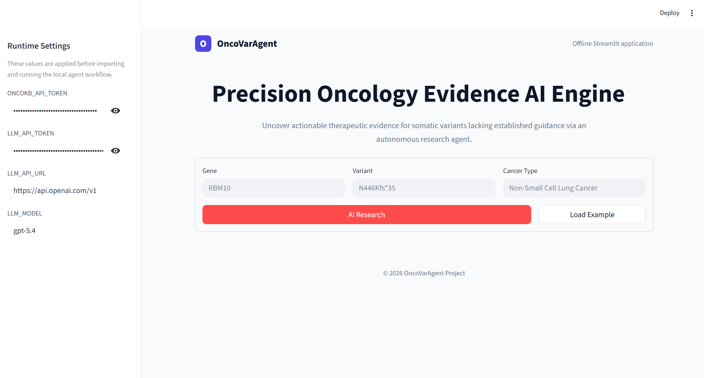

# OncoVarAgent Streamlit Offline App

This directory is intended to be copied and deployed as a standalone Streamlit app.


Bundled runtime scripts:

- `backend/OncoVarAgent.py`
- `oncokb-annotator/MafAnnotator.py`
- `oncokb-annotator/AnnotatorCore.py`

The Streamlit sidebar lets users configure runtime values:

- `ONCOKB_API_TOKEN`
- `LLM_API_TOKEN`
- `LLM_API_URL`
- `LLM_MODEL`

By default, `ONCOKB_ANNOTATOR_PATH` points to the bundled annotator:

```text
OncoVarAgent_Streamlit/oncokb-annotator/MafAnnotator.py
```

## Install

```powershell
pip install -r requirements.txt
```

If Windows blocks user-level package installation, install missing packages into the app-local dependency folder:

```powershell
pip install --target .deps langchain-openai
```

`streamlit_app.py` automatically adds `.deps` to `sys.path` when present.

## Run On Windows

```powershell
cd C:\path\to\OncoVarAgent_Streamlit
run_streamlit.bat
```

## Run On macOS/Linux

```bash
cd /path/to/OncoVarAgent_Streamlit
sh run_streamlit.sh
```

Then open:

```text
http://localhost:8501
```



